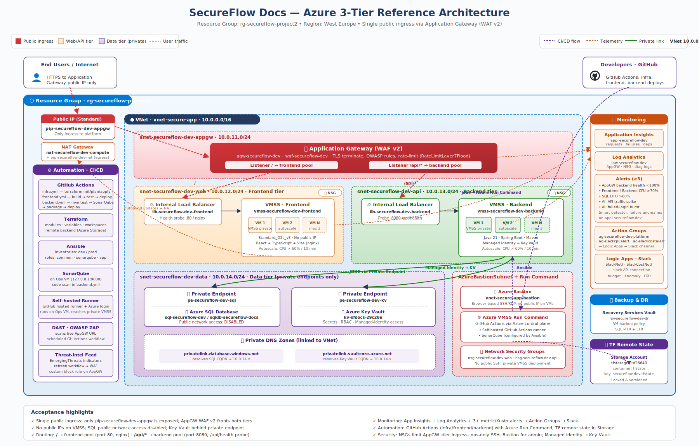

# SecureFlow Docs

SecureFlow Docs is a production-style enterprise document management and AI platform scaffold. It demonstrates a private Azure 3-tier architecture with a React + TypeScript + Vite frontend, Java Spring Boot/Maven backend, Azure SQL Database, Terraform infrastructure, Ansible configuration, and GitHub Actions automation.



## What The App Does

Companies can upload and manage contracts, invoices, HR documents, policies, and PDFs. The platform is shaped for AI-assisted organization, semantic search, important information extraction, approval tracking, digital signatures, and permission control.

Current reference implementation:

- Frontend dashboard for document status and workflow operations.
- Backend REST API for creating and reading document records.
- Local H2 database for development.
- Azure SQL Database target for production through a private endpoint.

## Repository Structure

```text
infra/terraform/              Azure resources, modules, variables, remote-state ready backend
config/ansible/               Host inventories and roles for patching, SonarQube, and app deploy
apps/frontend/                React + TypeScript + Vite frontend
apps/backend/                 Java 21 Spring Boot + Maven REST API
.github/workflows/            Infrastructure, frontend, and backend automation
docs/                         Architecture diagram and runbook
```

## Azure Architecture

- Existing resource group: `group1_final`.
- Existing VNet: `group1-final-vnet` (`10.2.0.0/16`).
- Ops VM: `group1-final` (`10.2.0.4`, public SSH entry used only for Ansible/bootstrap).
- New private subnets: `snet-appgw`, `snet-web`, `snet-api`, and `snet-data`.
- Application Gateway WAF v2 is the only public ingress.
- Public HTTPS URL: `https://135.116.238.100/` (self-signed certificate for project demo).
- `/` routes to private frontend VMSS `vmss-secureflow-dev-frontend` on port 80.
- `/api/*` routes to private backend VMSS `vmss-secureflow-dev-backend` on port 8080.
- VMSS instances use `Standard_D2s_v3` because Sweden Central B-series v2 quota is zero in this subscription.
- Compute tiers have no public IPs.
- Azure SQL public network access is disabled.
- SQL access is through Private Endpoint and Private DNS.
- Application Insights, Log Analytics, diagnostic settings, and metric alerts are included.
- Cost Management controls include a `$20` monthly resource-group budget, budget alerts, anomaly alerting, and a saved daily cost view.
- Compliance Mode adds CIS-style Azure Policy checks, Security Center recommendation review, and a `93%` audit posture dashboard.
- Backup and DR controls include Azure Backup vault/policy, SQL PITR/LTR, and Azure Portal recovery evidence.
- AI-powered log analysis detects WAF/API traffic spikes and failed-login bursts, then presents an `AI Security Summary`.
- Key Vault stores operational secrets behind a private endpoint with RBAC access for VMSS managed identities.
- A self-hosted GitHub Actions runner runs on the ops VM, and Azure Bastion Developer is managed by Terraform for private administrative access.

## Prerequisites

- Azure subscription with permission to create networking, compute, SQL, monitor, and Application Gateway resources.
- Azure CLI authenticated locally or OIDC secrets configured for GitHub Actions.
- Terraform `>= 1.6`.
- Ansible for VM configuration.
- Node.js 22 for frontend development.
- Java 21 and Maven for backend development.
- Budget/quota for Application Gateway WAF v2, Linux VMs, Azure SQL, and monitoring.

## Local Development

Run the backend:

```bash
cd apps/backend
mvn spring-boot:run
```

Run the frontend:

```bash
cd apps/frontend
npm install
npm run dev
```

Open the Vite URL and use the upload button. Vite proxies `/api` to `localhost:8080`.

## Provision Infrastructure

Copy the example variables and fill in secrets locally or through GitHub Actions secrets:

```bash
cp infra/terraform/terraform.tfvars.example infra/terraform/terraform.tfvars
cd infra/terraform
terraform init \
  -backend-config="resource_group_name=group1_final" \
  -backend-config="storage_account_name=tfstategrp1sf26640" \
  -backend-config="container_name=tfstate" \
  -backend-config="key=secureflow-dev.tfstate"
terraform plan -out=tfplan
terraform apply tfplan
```

For GitHub Actions remote state, configure these secrets:

- `AZURE_CLIENT_ID`
- `AZURE_TENANT_ID`
- `AZURE_SUBSCRIPTION_ID`
- `TFSTATE_RESOURCE_GROUP`
- `TFSTATE_STORAGE_ACCOUNT`
- `TFSTATE_CONTAINER`
- `SSH_PUBLIC_KEY`
- `SQL_ADMIN_PASSWORD`
- `ALERT_EMAIL`

## Configure With Ansible

Update `config/ansible/inventories/prod/hosts.ini` with private IPs from Terraform outputs, then run from a host that can reach the private VNet:

```bash
ansible-galaxy collection install -r config/ansible/requirements.yml
ansible-playbook config/ansible/site.yml -i config/ansible/inventories/prod/hosts.ini
```

## Deploy With GitHub Actions

- `.github/workflows/infra.yml`: Terraform init, fmt, validate, plan, and optional apply.
- `.github/workflows/frontend.yml`: install, build, package, and deploy frontend.
- `.github/workflows/backend.yml`: Maven test/package, optional SonarQube scan, and deploy backend.

Frontend and backend are intentionally independent deployables.

## Validate

After deployment, run:

```bash
curl -k https://135.116.238.100/
```

Acceptance proof checklist:

- Homepage loads through Application Gateway: `GET /` returns 200.
- Backend routes through Application Gateway: `GET /api/health` returns `{"status":"UP","service":"secureflow-docs-api"}`.
- Authenticated `POST /api/documents` creates a SQL-backed document record.
- Authenticated `GET /api/documents` returns only records for the logged-in user/signer.
- Frontend and backend default/public URLs are not exposed.
- VMSS public IP lists are empty for frontend and backend.
- SQL Server `sql-secureflow-dev.database.windows.net` has public network access disabled.
- Private DNS resolves the SQL private endpoint.
- App Gateway backend health probes are healthy.
- At least three alerts exist: App Gateway backend health, VM CPU, SQL DTU.
- Cost monitoring exists: monthly budget alert, forecasted overspend alert, anomaly alert, and Cost Management view.
- Compliance Mode exists: CIS benchmark controls, Azure Policy assignment, Security Center recommendations, and `93%` posture documented as Azure governance evidence.
- Backup and DR exists: Recovery Services Vault, VM backup policy, SQL PITR retention, SQL LTR policy, and recovery drill runbook.
- AI log analysis exists: Log Analytics Kusto rules, scheduled query alerts, and AI Security Summary evidence in Azure monitoring docs.
- Key Vault exists: private endpoint, private DNS, secret inventory, and documented VMSS SSH jump-host access.

Verified deployment on April 30, 2026:

- `terraform apply`: complete, all resources in `group1_final`.
- Ansible: common, SonarQube, frontend, and backend plays completed with zero failures.
- App Gateway backend health: frontend `10.2.2.4` healthy, backend `10.2.3.4` healthy.
- E2E API test through gateway from ops VM: login as `duyghu@company.com`, upload `secureflow-test-contract.txt`, read document ID `1`.
- SonarQube: reachable on the ops VM at `http://127.0.0.1:9000`.

## Screenshots To Add For Submission

Place evidence images in `docs/screenshots/`:

- `gateway-homepage.png`
- `resource-group.png`
- `app-gateway-backend-health.png`
- `sql-private-endpoint.png`
- `alerts-dashboard.png`
- `cost-management-budget.png`
- `cost-analysis-view.png`
- `compliance-mode-ui.png`
- `azure-policy-compliance.png`
- `security-center-recommendations.png`
- `dr-readiness-ui.png`
- `recovery-services-vault.png`
- `sql-pitr-restore.png`
- `ai-security-summary-ui.png`
- `ai-log-alerts.png`
- `waf-kusto-query.png`
- `key-vault-secrets.png`
- `vmss-ssh-through-ops.png`

## Short Demo

1. Show the architecture diagram.
2. Open the gateway URL and load the SecureFlow Docs homepage.
3. Create a demo document and show it returned by the API.
4. Show no public IPs on compute and disabled SQL public access.
5. Show App Gateway `/` and `/api/*` routing.
6. Show Application Insights, Log Analytics, and alerts.
7. Show Azure Cost Management budget/anomaly controls from [docs/cost-monitoring-dashboard.md](docs/cost-monitoring-dashboard.md).
8. Show Compliance Mode from [docs/compliance-mode.md](docs/compliance-mode.md).
9. Show Backup and DR from [docs/backup-disaster-recovery.md](docs/backup-disaster-recovery.md).
10. Show AI-powered log analysis from [docs/ai-powered-log-analysis.md](docs/ai-powered-log-analysis.md).
11. Show Key Vault and private VMSS access from [docs/key-vault-and-vmss-access.md](docs/key-vault-and-vmss-access.md).
12. Show GitHub Actions workflows for Terraform and app deploy.
