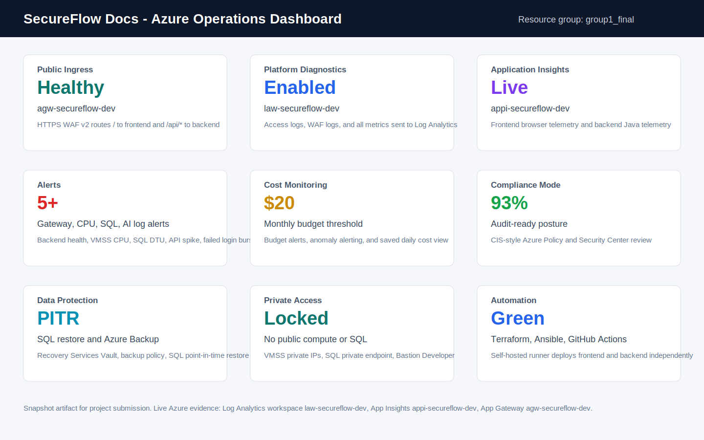

# SecureFlow Docs

SecureFlow Docs is a production-style enterprise document management and AI platform scaffold built on Azure. The project demonstrates a secure, scalable, and highly available private 3-tier Azure architecture using a React + TypeScript + Vite frontend, Java Spring Boot/Maven backend, Azure SQL Database, Terraform infrastructure, Ansible configuration management, and GitHub Actions CI/CD automation.

The platform modernizes a legacy single-VM application by improving scalability, availability, security, automation, monitoring, compliance, backup/recovery, and operational visibility through enterprise-style Azure architecture patterns.


---

# What The App Does

Companies can upload and manage:
- Contracts
- HR documents
- Policies
- PDFs
- Invoices
- Approval workflows

The platform is designed for:
- AI-assisted document organization
- Semantic search
- Information extraction
- Digital approval workflows
- Permission management
- Secure document operations

## Current Reference Implementation

- React + TypeScript + Vite frontend dashboard
- Java Spring Boot REST API backend
- Azure SQL production database
- Local H2 development database
- Secure API-based document operations
- Private Azure networking

---

# Repository Structure

```text
infra/terraform/              Azure resources, modules, variables, remote-state backend
config/ansible/               Host inventories and automation roles
apps/frontend/                React + TypeScript + Vite frontend
apps/backend/                 Java 21 Spring Boot + Maven backend
.github/workflows/            Infrastructure and CI/CD automation
docs/                         Architecture diagrams, screenshots, and runbook
README.md
```

---

# Azure Architecture

## Core Infrastructure

- Existing resource group: `group1_final`
- Existing VNet: `group1-final-vnet`
- Ops VM: `group1-final`
- Private subnets:
  - `snet-appgw`
  - `snet-web`
  - `snet-api`
  - `snet-data`

## Traffic Architecture

```text
Internet
  -> Application Gateway WAF v2
  -> Internal Load Balancers
  -> Frontend / Backend VMSS
  -> Azure SQL Database through Private Endpoint
```

## Public Access

- Public HTTPS URL:
  - `https://e-document.tech/`
- Application Gateway WAF v2 is the only public ingress point.
- `/` routes to frontend VMSS.
- `/api/*` routes to backend VMSS.

## Private Infrastructure

- Frontend and backend VMSS instances have no public IPs.
- Azure SQL public network access is disabled.
- SQL access uses Private Endpoint + Private DNS.
- Internal Load Balancers remain private.
- Administrative access uses:
  - Azure Bastion
  - Ops VM jump host
  - Private networking

---

# Scalability & Availability

The original legacy environment relied on a single VM, creating:
- single points of failure,
- limited scalability,
- availability risks,
- and performance bottlenecks.

SecureFlow Docs introduces horizontal scaling and layered load balancing.

## Implemented Controls

- Frontend VMSS
- Backend VMSS
- Internal Azure Load Balancers
- Application Gateway backend pools
- Health probes
- Autoscaling support
- Independent frontend/backend scaling

## Load Balancing

### Implemented Components

- Public load balancer:
  - `agw-secureflow-dev`
- Frontend ILB:
  - `ilb-secureflow-dev-frontend`
- Backend ILB:
  - `ilb-secureflow-dev-backend`

### Health Probes

- Frontend:
  - `/health`
- Backend:
  - `/api/health`

## Benefits

- Eliminates single points of failure
- Improves application availability
- Enables horizontal scaling
- Separates public and private traffic
- Supports future autoscaling expansion

---

# Security Architecture

Security is the highest project priority.

## Core Security Controls

- Application Gateway WAF v2 in Prevention Mode
- Private VMSS instances
- No compute public IPs
- Azure SQL public access disabled
- NSG ingress restrictions
- Private Endpoints
- Azure Key Vault private access
- Managed Identity authentication
- Threat intelligence IP blocking
- Layer 7 flood protection
- OWASP ZAP DAST validation

---

# Key Vault & Secret Management

SecureFlow Docs stores operational secrets in a private Azure Key Vault.

## Implemented Controls

- Private Key Vault
- RBAC authorization
- Private Endpoint
- Managed Identity access
- Purge protection
- Soft delete enabled

## Stored Secrets

- SQL credentials
- SSH keys
- Runtime application secrets
- Application Gateway certificate secrets

## Managed Identity Runtime Access

Backend VMSS instances retrieve runtime secrets directly from Key Vault through Managed Identity without exposing credentials in GitHub Actions pipelines.

---

# Threat Intelligence Feed Integration

SecureFlow Docs implements SOC-style threat intelligence blocking at the WAF layer.

## Implemented Controls

- WAF policy:
  - `waf-secureflow-dev`
- Threat intelligence rule:
  - `BlockThreatIntelIPs`
- EmergingThreats feed integration
- Automated GitHub Actions refresh workflow

## Benefits

- Blocks known malicious IPs
- Stops threats before reaching private infrastructure
- Demonstrates lightweight SOC automation

---

# Layer 7 Flood Protection

SecureFlow Docs includes HTTP flood protection through custom WAF rate-limiting rules.

## Implemented Controls

- WAF rate-limit custom rules
- Client request burst detection
- Automatic blocking action
- Threshold:
  - `120` requests per minute

## Benefits

- Prevents HTTP flood abuse
- Reduces backend overload risk
- Protects `/api/*` endpoints

---

# Monitoring & Observability

The platform includes centralized logging, telemetry, alerting, and operational visibility.

## Monitoring Stack

- Application Insights
- Log Analytics
- Azure Monitor
- Kusto Query Language (KQL)
- Azure Dashboards
- Diagnostic settings
- Metric alerts

## Implemented Alerts

- App Gateway backend health alerts
- High CPU alerts
- SQL utilization alerts
- API traffic spike alerts
- Failed login burst alerts

---

# AI-Powered Log Analysis

SecureFlow Docs includes AI-assisted security analytics for suspicious API activity, WAF events, and authentication attacks.

## Implemented Controls

- Application Gateway access log analysis
- WAF log analysis
- Application Insights telemetry analysis
- Kusto-based anomaly detection
- AI Security Summary evidence

## Detection Logic

### API Traffic Spike Detection

Detects concentrated `/api/*` traffic bursts from individual clients.

### Failed Login Burst Detection

Detects repeated failed login attempts within short time windows.

## Benefits

- Faster security investigations
- Improved operational visibility
- Demonstrates AI-assisted SOC concepts
- Extensible to Azure OpenAI integration

---

# Compliance Mode

SecureFlow Docs includes audit-style governance and CIS-aligned Azure Policy controls.

## Implemented Controls

- Custom CIS-style Azure Policy initiative
- Azure Policy assignment
- Security Center recommendation review
- Audit-only governance mode

## Governance Checks

- SQL public access disabled
- No compute public IP exposure
- Mandatory Application Gateway WAF usage

## Compliance Result

- Demonstrated governance posture:
  - `100% Compliant`

---

# Backup & Disaster Recovery

SecureFlow Docs includes enterprise-style backup and disaster recovery controls.

## Implemented Controls

- Recovery Services Vault
- Geo-redundant backup storage
- Daily VM backups
- Azure SQL Point-in-Time Restore
- Long-term SQL retention policies
- Soft delete enabled

## Recovery Objectives

- VM backup RPO under 24 hours
- SQL PITR recovery support
- Controlled database recovery process

---

# Cost Monitoring & FinOps

SecureFlow Docs includes operational cost governance and FinOps controls.

## Implemented Controls

- Monthly Azure budget
- Budget alerts
- Forecast alerts
- Cost anomaly detection
- Cost Management dashboard views

## Budget Rules

- 50% budget alert
- 80% budget alert
- 100% forecast alert

## Benefits

- Prevents unexpected cloud spending
- Demonstrates FinOps operational awareness
- Maintains predictable infrastructure costs

---

# Dynamic Application Security Testing (DAST)

The platform performs external security validation using OWASP ZAP.

## Implemented Controls

- OWASP ZAP baseline scanning
- Self-hosted GitHub Actions runner
- Automated DAST workflows
- HTML/JSON/Markdown reports

## Validation Scope

- Public Application Gateway URL
- HTTPS validation
- API exposure checks
- Header and cookie inspection

## Benefits

- Tests the live deployed environment
- Validates external attack surface
- Complements SAST and SonarQube scanning

---

# Automation & DevOps

SecureFlow Docs fully automates provisioning, deployment, configuration, monitoring, and validation workflows.

## Terraform

Automates:
- Networking
- VMSS deployment
- SQL deployment
- WAF
- Private Endpoints
- Monitoring
- Alerts
- Backup infrastructure

## Ansible

Automates:
- VM hardening
- SonarQube deployment
- Runtime configuration
- Package installation
- Secret rendering

## GitHub Actions

Automates:
- Terraform workflows
- Frontend deployment
- Backend deployment
- DAST scanning
- Security validation
- Threat intelligence refresh

---

# Prerequisites

- Azure subscription with required permissions
- Azure CLI
- Terraform `>= 1.6`
- Ansible
- Node.js `22`
- Java `21`
- Maven
- Budget/quota for Azure infrastructure resources

---

# Local Development

## Backend

```bash
cd apps/backend
mvn spring-boot:run
```

## Frontend

```bash
cd apps/frontend
npm install
npm run dev
```

Vite proxies `/api` traffic to `localhost:8080`.

---

# Provision Infrastructure

```bash
cp infra/terraform/terraform.tfvars.example infra/terraform/terraform.tfvars

cd infra/terraform

terraform init \
  -backend-config="resource_group_name=group1_final" \
  -backend-config="storage_account_name=tfstategrp1sf26640" \
  -backend-config="container_name=tfstate" \
  -backend-config="key=secureflow-dev.tfstate"

terraform plan -out=tfplan

terraform apply tfplan
```

---

# Configure With Ansible

```bash
ansible-galaxy collection install -r config/ansible/requirements.yml

ansible-playbook config/ansible/site.yml \
  -i config/ansible/inventories/prod/hosts.ini
```

---

# Deploy With GitHub Actions

## Workflows

- `infra.yml`
- `frontend.yml`
- `backend.yml`

Frontend and backend are intentionally independent deployables.

---

# Validation Checklist

## Functional Validation

- Homepage accessible through Application Gateway
- `/api/health` returns healthy response
- API write/read operations successful
- SQL connectivity validated

## Security Validation

- No compute public IPs
- SQL public access disabled
- Private DNS resolution operational
- WAF blocking validated

## Monitoring Validation

- Application Insights telemetry operational
- Log Analytics data collection active
- Alerts successfully configured

---

# Azure Dashboard Snapshot



The dashboard summarizes:
- Application Gateway health
- WAF monitoring
- Log Analytics diagnostics
- Application Insights telemetry
- Cost monitoring
- Compliance posture
- Backup and DR readiness
- Automation status

---

# Kusto Queries

## Application Gateway Access Logs

```kusto
AzureDiagnostics
| where ResourceType == "APPLICATIONGATEWAYS"
| where Category == "ApplicationGatewayAccessLog"
| project TimeGenerated, clientIP_s, requestUri_s, httpStatus_d
| order by TimeGenerated desc
```

## WAF Block Events

```kusto
AzureDiagnostics
| where Category == "ApplicationGatewayFirewallLog"
| summarize Blocks=count() by ruleId_s, Message
| order by Blocks desc
```

## Application Failures

```kusto
requests
| where cloud_RoleName contains "secureflow"
| summarize failures=countif(success == false), total=count() by bin(timestamp, 5m)
```

---

# Verified Deployment

Verified deployment on April 30, 2026:

- Terraform deployment completed successfully
- Ansible completed with zero failures
- Frontend and backend health probes healthy
- End-to-end API validation successful
- SonarQube operational on ops VM

---

# Runbook

Operational deployment, recovery, troubleshooting, and maintenance procedures are documented separately:

```text
docs/runbook.md
```
